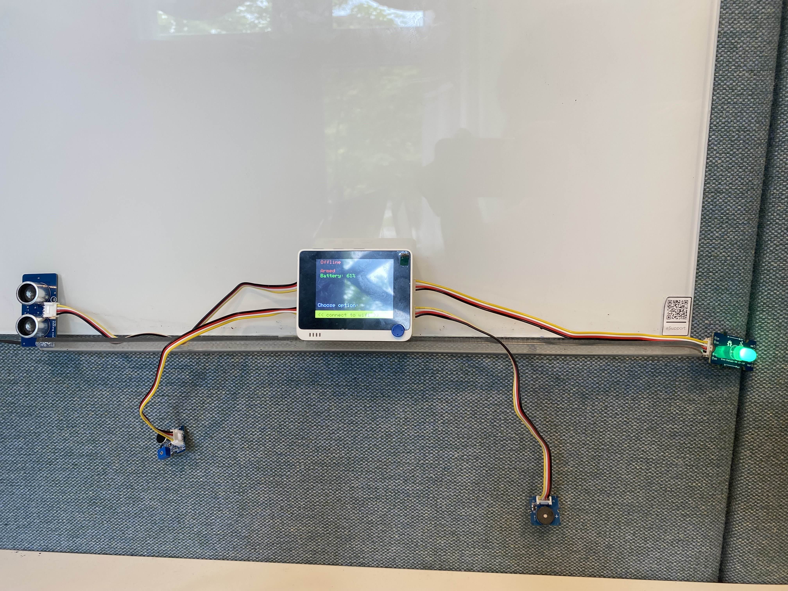

# Pavel Security System 

## Table of Contents

- [System description](#system-description)
- [Purpose and benefits](#purpose-and-benefits-of-the-system)
- [System Architecture](#system-architecture)
- [Setup Manual](#setup-manual)  
    - [Connecting to a power source](#connecting-to-a-power-source)
    - [Connecting the sensors](#connecting-the-sensors)
    - [How to deploy](#how-to-deploy)
        - [Installing dependencies](#installing-dependencies)
        - [Uploading the source code](#uploading-the-source-code)
- [Contributions](#contributions)
- [Tools & Hardware used](#tools--hardware-used)
- [For developers](#development-guidelines)
- [License](#lincense)

## System Description

Pavel security system intends to prevent break-ins by notifying users about suspicious activities outside their doors. 
It provides an application where users can arm, disarm and manually trigger the system. 
Additionally, users can receive notifications and check the device’s history of events.
Pavel security system makes use of an Arduino based Terminal, called the [Wio Terminal](https://wiki.seeedstudio.com/Wio-Terminal-Getting-Started/) by Seeed Studio. 
The system provides two means of interaction for users; it has a Web Application and a display through the Wio Terminal. 

## Purpose and benefits of the system 
Pavel Security System is a simple and reliable IoT solution to increase the security of the homes of our customers, and is relatively easy-to-use for regular people. 

Our System provides an authentication mechanism, which lets users connect to their security system securely from anywhere, after inputting their credentials, that is provided to them out of the box.

For convenience, the Seeed Wio Terminal has its own User Interface, that allows users to interact with the system and perform all necessary actions, such as connecting to a Wifi network and allows them to arm or disarm the system without having to use the Web Application. 

// TODO: you can also see information about the system there 

## System Architecture
Pavel security system is composed of 3 layers; the Web Application & authentication layer, the broker layer and the device software & email server layer. Each layer has its own software components and serves a unique purpose.

The Web Application & authentication layer provides the user with a visual interface after and only after they have been authenticated by the Authentication Server and static file server.

The device software & email server layer handles reading and processing input data, sending email notifications and displaying system info on the Wio terminal.

Lastly, the broker layer handles communication between the other two layers with a pub/sub model.

*Diagram of the Architecture:*

## Setup Manual

### Connecting to a power source

In order to use the terminal you have to connect it to some power source.

⚠️ Make sure that you have the ["Wio Terminal Chassis Battery"](https://wiki.seeedstudio.com/Wio-Terminal-Chassis-Battery_650mAh/) that you can easily connect using the pins on the front of the battery/chassis to the back of the terminal.

You can use a USB-C to charge the battery. To turn the battery on, hold down the black button on the back side of the battery.

### Connecting the sensors

Once you've connected the battery/chassis you have to plug in the sensors into the ports on the chassis in the following way:

### How to deploy
-----
Now that you've connected the sensors and provided power, you can now turn the device on. Put it on middle position.

#### Installing dependencies 
⚠️
Note: Make sure you have [Arduino CLI](https://docs.arduino.cc/arduino-cli/installation/) installed.

1. Download the following dependencies by using the Arduino CLI
<pre><code>
arduino-cli lib install "Grove Ultrasonic Ranger@1.0.1"
arduino-cli lib install "PubSubClient@2.8"
arduino-cli lib install "Seeed Arduino rpcWifi@1.1.0"
arduino-cli lib install "SparkFun BQ27441 LiPo Fuel Gauge Arduino Library@1.1.0"
arduino-cli lib install "Seeed Arduino rpcWifi@1.1.0"
arduino-cli lib install "ArduinoJson@7.4.1"
arduino-cli lib install "NTPClient@3.2.1"
arduino-cli lib install "Time@1.6.1"

</code></pre>

Furthermore you have to install this the following [zip file](https://github.com/Seeed-Studio/Grove_Chainable_RGB_LED/archive/refs/heads/master.zip) and unzip it into the Arduino/libaries folder

#### Uploading the source code 

// REMOVE:
2. Once you have all the dependencies listed, you have to compile the code
<pre><code>arduino-cli compile --fqbn Seeeduino:samd:seeed_wio_terminal</code></pre>

3. Upload the compiled bin file to the terminal using the following command:
<pre><code>arduino-cli upload -t < path to bin > -b Seeeduino:samd:seeed_wio_terminal -p < port > </code></pre>

4. Download [Node.js](https://nodejs.org/en/download) and run the following command through the terminal after navigating inside the Web Application/javascript folder:

<pre><code>npm install</code></pre>

5. Run the following commands in different terminals/consoles
<pre><code>node web-server.cjs</pre></code>
<pre><code>node auth-server.cjs</pre></code>
<pre><code>node server.cjs</code></pre>

⚠️ Note: Once you've run the command, you must leave all of these terminal open to in order for the application to work properly.

6. Create an file named ".env" in the javascript folder using the *following format*

<pre><code>
EMAIL_USER=pavelssystem@gmail.com
EMAIL_PASS=ucxt uvkl rkmr gsva
ADMIN_EMAIL=personalemail@example.com
ADMIN_PASSWORD=password_goes_here
EMAIL_NOTIFICATION=personalemail@example.com
</code></pre>
⚠️ Note: Do not change the EMAIL_USER and EMAIL_PASS, as it is the email address that you get the notifications from 

7. Open the browser of your choice and type [http://localhost:3001/html/login.html](http://localhost:3001/html/login.html).

8. Log in

Now you can arm and disarm your security system and get notification on the application and by email about potential intruders and information about the state of your battery.

## Contributions 

| Name                  | GitLab Handle(s)                 | Contributions                                                                                  |
|-----------------------|----------------------------------|-----------------------------------------------------------------------------------------------|
| **Pavel Dejkoski**        | @dejkoski                        | CI/CD pipeline, Email notification server, Logs (storing and sending through MQTT), Arduino UI, Website Notifications, Arduino and Web Page MQTT connection |
| **Simon Nilrud**          | @Ovan81, @nilrud                 | Web Page frontend, Log display, Manual triggering functionality, Sound-distance weight-based triggering |
| **Volodymyr Filippov**    | @volfil                          | Arduino UI & Network connection, Arduino UI                                                   |
| **Riad Santir**           | @santir                          | Web Page Authentication Server and frontend                                                   |
| **Máté Stier**            | @mates                           | CI/CD pipeline, Arduino sensor and actuator logic, Arduino MQTT connection, Arduino UI        |

## Tools & Hardware used 
- Hardware
    - [Wio terminal](https://wiki.seeedstudio.com/Wio-Terminal-Getting-Started/)
    - [Battery Chassis](https://wiki.seeedstudio.com/Wio-Terminal-Chassis-Battery_650mAh/)
    - [Ultrasonic Ranger](https://wiki.seeedstudio.com/Grove-Ultrasonic_Ranger/)
    - [Chainable RGB LED](https://wiki.seeedstudio.com/Grove-Chainable_RGB_LED/)
    - [Buzzer](https://wiki.seeedstudio.com/Grove-Buzzer/)
    - [SD card (min. 2GB)](https://en.wikipedia.org/wiki/SD_card)
- Software Tools
    - [Node.js](https://nodejs.org/en/download)
    - [Bootstrap.js](https://getbootstrap.com/docs/5.0/getting-started/introduction/)
    - [Arduino IDE](https://www.arduino.cc/en/software/)
    - [Draw.io](https://en.wikipedia.org/wiki/Diagrams.net)

## Development Guidelines

If you intend on contributing to our project, read our [Development Guideline](https://git.chalmers.se/courses/dit113/2025/group-3/security-system/-/wikis/Development-Guidelines).
## License

This project is licensed under the [GNU General Public License v3.0](LICENSE).
